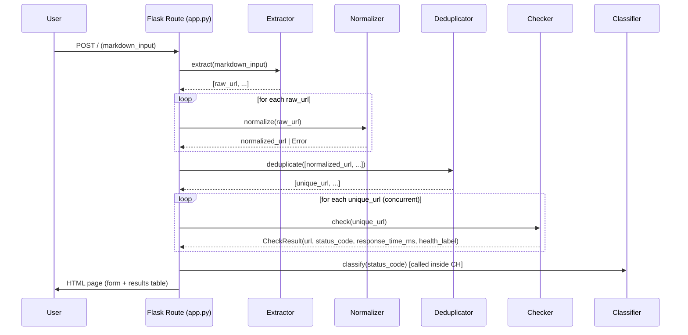
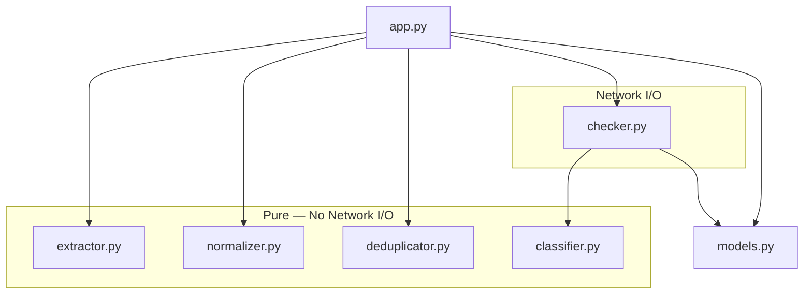

# Design Document — LinkSentry

## Overview

LinkSentry is a small, self-contained Flask web application. The user pastes Markdown text into a single-page form, submits it, and receives a table showing the health of every HTTP/HTTPS link found in that text. The entire interaction happens on one page: the form POST returns an HTML response that includes both the re-rendered form and the results table.

The design deliberately avoids every form of external infrastructure: no database, no message queue, no background workers, no authentication, no cloud services. All work happens synchronously within a single HTTP request-response cycle.

The central architectural principle is **pure-logic/I/O separation**. Four components — Extractor, Normalizer, Deduplicator, and Classifier — are pure functions with no network access. One component — the Checker — is the sole owner of all network I/O. This split allows the four pure components to be tested exhaustively without any network access, and it keeps the Checker's contract narrow and mockable.

### High-Level Data Flow



---

## Architecture

### Package Structure

```
linksentry/
├── app.py                   # Flask application factory and route handler
├── requirements.txt         # Pinned Python dependencies
├── linksentry/
│   ├── __init__.py
│   ├── extractor.py         # Extractor — pure function, no I/O
│   ├── normalizer.py        # Normalizer — pure function, no I/O
│   ├── deduplicator.py      # Deduplicator — pure function, no I/O
│   ├── classifier.py        # Classifier — pure function, no I/O
│   ├── checker.py           # Checker — all network I/O lives here
│   └── models.py            # CheckResult dataclass
├── templates/
│   └── index.html           # Single Jinja2 template (form + results)
├── static/
│   └── style.css            # Health indicator styles
└── tests/
    ├── test_extractor.py
    ├── test_normalizer.py
    ├── test_deduplicator.py
    ├── test_classifier.py
    ├── test_checker.py
    └── test_app.py
```

### Component Dependency Graph



The `Checker` is the only component that imports `requests`. All other components import only Python standard library modules (`re`, `urllib.parse`) or the `models` module.

---

## Components and Interfaces

### 1. Extractor (`linksentry/extractor.py`)

Parses Markdown text and returns raw URL strings in order of first appearance, including duplicates.

```python
def extract(markdown_input: str) -> list[str]:
    """
    Return all HTTP/HTTPS URLs found in markdown_input, in order of
    first appearance, including duplicate raw URLs as separate entries.

    Recognized syntaxes:
      - Inline links:     [text](url) and [text](url "title")
      - Reference links:  [text][id] with [id]: url definitions
      - Autolinks:        <url>
      - Bare URLs:        http:// or https:// with trailing punctuation stripped

    Returns raw URL strings exactly as they appear (after stripping
    trailing punctuation from bare URLs). Never raises; returns [] on
    empty or URL-free input.

    No network I/O is performed.
    """
```

**Algorithm:**

1. **Reference link definitions pass**: scan the full text with a regex for `[id]: url` patterns and build a `dict[str, str]` mapping label → URL. Labels are compared case-insensitively per CommonMark.
2. **Reference link usage pass**: find `[text][id]` patterns; for each matched `id`, look up the definition dict and emit the URL if found; unmatched IDs are silently skipped.
3. **Inline link pass**: find `[text](url)` and `[text](url "title")` patterns with a regex; emit the URL group.
4. **Autolink pass**: find `<http://…>` and `<https://…>` patterns; emit the inner URL.
5. **Bare URL pass**: find `https?://\S+` patterns; strip trailing punctuation characters (`. , ) ] ! ? ; :`) from the end of each match; emit the stripped URL.
6. Merge all collected (position, url) pairs, sort by position, and return URLs in that order.

Because all five passes scan the same source text, the sort-by-position step is needed to interleave results correctly. Overlapping matches (e.g., a bare URL that is also inside an inline link) are deduplicated by position before sorting so that each character position yields at most one URL.

### 2. Normalizer (`linksentry/normalizer.py`)

Transforms a raw URL string into Canonical Form.

```python
from dataclasses import dataclass
from typing import Union

@dataclass(frozen=True)
class NormalizerError:
    message: str

def normalize(raw_url: str) -> Union[str, NormalizerError]:
    """
    Return the Canonical Form of raw_url, or NormalizerError if
    raw_url is not a syntactically valid HTTP/HTTPS URL.

    Canonical Form rules (applied in order):
      1. Scheme lowercased
      2. Host lowercased
      3. Default port removed (80 for http, 443 for https)
      4. Empty path set to "/"
      5. Trailing slashes removed from non-root paths
      6. Percent-encoded characters in path normalized:
         - Hex digits uppercased  (%2f → %2F)
         - Unreserved chars decoded (%41 → A, %7e → ~, etc.)
      7. Query string and fragment preserved unchanged

    Returns NormalizerError for:
      - Missing scheme
      - Non-http/https scheme
      - Empty host
      - Unparseable URL structure

    No network I/O is performed.
    """
```

**Algorithm (using `urllib.parse.urlsplit`):**

1. Parse with `urlsplit`. If `scheme` is empty or `netloc` is empty, return `NormalizerError`.
2. If `scheme` not in `{'http', 'https'}`, return `NormalizerError`.
3. Lowercase `scheme` and split `netloc` into `host:port`.
4. Lowercase `host`.
5. Strip default port: if port == 80 and scheme == 'http', or port == 443 and scheme == 'https', omit the port.
6. Normalize the path:
   - If empty, set to `/`.
   - If not `/`, strip trailing `/` characters.
   - Apply percent-encoding normalization via a regex that replaces `%xx` sequences: decode unreserved chars, uppercase hex digits for all others.
7. Reassemble with `urlunsplit`.

> **Note:** `urlsplit`/`urlunsplit` are used instead of `urlparse`/`urlunparse` to avoid the `params` component that `urlparse` splits out on semicolons in the path. That split caused a normalization idempotence failure discovered by Hypothesis (Property 2), where a second call to `normalize()` would reinsert the `;` separator and produce a different string. `urlsplit` treats the URL as a five-component tuple with no `params`, eliminating the issue.

### 3. Deduplicator (`linksentry/deduplicator.py`)

Removes duplicate Normalized_URLs, preserving first-occurrence order.

```python
def deduplicate(urls: list[str]) -> list[str]:
    """
    Return a new list containing each distinct string from urls exactly
    once, in first-occurrence order.

    Comparison is case-sensitive byte-for-byte string equality.
    Empty input returns [].

    No network I/O is performed.
    """
```

**Algorithm:** Iterate `urls`; maintain a `set` of seen strings and an output `list`. Append each URL to output only if it has not been seen; add it to the set in either case. O(n) time and space.

### 4. Classifier (`linksentry/classifier.py`)

Maps an HTTP status code (or `None`) to a `Health_Label`.

```python
from linksentry.models import HealthLabel

def classify(status_code: int | None) -> HealthLabel:
    """
    Map status_code to a HealthLabel:
      200–299  → HealthLabel.HEALTHY
      300–399  → HealthLabel.REDIRECT
      400–599  → HealthLabel.BROKEN
      None     → HealthLabel.BROKEN
      < 200    → HealthLabel.BROKEN
      > 599    → HealthLabel.BROKEN
      non-int/non-None → HealthLabel.BROKEN

    Pure function; same input always produces same output.
    No network I/O is performed.
    """
```

**Algorithm:** Single guard chain:
1. If `status_code` is `None` or not an `int`, return `BROKEN`.
2. `200 <= status_code <= 299` → `HEALTHY`.
3. `300 <= status_code <= 399` → `REDIRECT`.
4. Default → `BROKEN`.

### 5. Checker (`linksentry/checker.py`)

The sole component that performs network I/O. Issues HTTP HEAD (with GET fallback) and returns a `CheckResult`.

```python
from linksentry.models import CheckResult

DEFAULT_TIMEOUT = 10  # seconds
DEFAULT_USER_AGENT = "LinkSentry/1.0"
MAX_REDIRECTS = 10

def check(
    url: str,
    timeout: float = DEFAULT_TIMEOUT,
    user_agent: str = DEFAULT_USER_AGENT,
) -> CheckResult:
    """
    Issue an HTTP HEAD request to url.  If the server does not return a
    valid HTTP response, retry with GET.  Follow up to MAX_REDIRECTS
    redirects, recording the final status code.

    Returns a CheckResult with:
      - url: the input url (Normalized_URL)
      - status_code: final HTTP status code, or None on timeout/network error
      - response_time_ms: elapsed ms from first request to final response
                          headers received (non-negative integer), or None
      - health_label: classify(status_code)

    Exceptions are caught internally; a failing URL always returns a
    CheckResult with null status_code and health_label BROKEN.
    """
```

**Algorithm:**

1. Record `start = time.monotonic()`.
2. Build a `requests.Session` with the `User-Agent` header set and `max_redirects=MAX_REDIRECTS`. Use `allow_redirects=True`.
3. Issue `session.head(url, timeout=timeout)`. On success, record `status_code` and `elapsed`.
4. On `requests.exceptions.HTTPError` or any response that indicates HEAD is not supported (method-not-allowed, or non-HTTP-error exception that is not a network error), fall back to `session.get(url, timeout=timeout, stream=True)` — `stream=True` avoids downloading the body; close immediately after reading headers.
5. Catch `requests.exceptions.Timeout` and `requests.exceptions.ConnectionError` (covers DNS, refused, TLS) → set `status_code = None`, `elapsed = None`.
6. Catch all other `Exception` → set `status_code = None`, `elapsed = None`.
7. Compute `response_time_ms = int((time.monotonic() - start) * 1000)` if not None.
8. Call `classify(status_code)` to get `health_label`.
9. Return `CheckResult(url, status_code, response_time_ms, health_label)`.

### 6. Flask Route Handler (`app.py`)

```python
from flask import Flask, render_template, request, abort

app = Flask(__name__)
MAX_INPUT_LENGTH = 500_000

@app.route("/", methods=["GET", "POST"])
def index():
    """
    GET  → render the empty form.
    POST → validate input, run the pipeline, render results.
           Returns 400 if input exceeds MAX_INPUT_LENGTH.
           Returns 500 (with error template) on unexpected pipeline error.
    """
```

**POST pipeline (in order):**

1. Read `markdown_input` from form data.
2. If `len(markdown_input) > MAX_INPUT_LENGTH`, `abort(400)` with human-readable message.
3. Call `extract(markdown_input)` → `raw_urls`.
4. For each raw URL call `normalize(url)`. Collect valid `Normalized_URL` strings; skip (log) `NormalizerError` results.
5. Call `deduplicate(normalized_urls)` → `unique_urls`.
6. If `unique_urls` is empty, render template with `no_links=True`.
7. Check each URL concurrently using `concurrent.futures.ThreadPoolExecutor`. Preserve input order in results.
8. Compute summary counts.
9. Render `index.html` with results.

**Concurrency:** A `ThreadPoolExecutor` is used (not `asyncio`) to keep the code simple and compatible with Python's `requests` library. The worker count defaults to `min(32, len(unique_urls))` — matching Python's default thread pool heuristic. Because the GIL is released during I/O, threads provide true concurrency for the network-bound Checker calls.

**PORT support:**

```python
if __name__ == "__main__":
    import os, sys
    port_str = os.environ.get("PORT", "5000")
    try:
        port = int(port_str)
        if not (1 <= port <= 65535):
            raise ValueError
    except ValueError:
        print(f"Invalid PORT value: {port_str!r}", file=sys.stderr)
        sys.exit(1)
    app.run(host="127.0.0.1", port=port)
```

---

## Data Models

### `HealthLabel` enum (`linksentry/models.py`)

```python
from enum import Enum

class HealthLabel(str, Enum):
    HEALTHY  = "Healthy"
    REDIRECT = "Redirect"
    BROKEN   = "Broken"
```

Using `str` as a mixin means `HealthLabel.HEALTHY == "Healthy"` is `True` and Jinja2 templates can render the value directly.

### `CheckResult` dataclass (`linksentry/models.py`)

```python
from dataclasses import dataclass

@dataclass(frozen=True)
class CheckResult:
    url: str                    # Normalized_URL
    status_code: int | None     # Final HTTP status, or None
    response_time_ms: int | None  # Non-negative integer ms, or None
    health_label: HealthLabel   # Derived by Classifier
```

`frozen=True` makes instances hashable and prevents accidental mutation after creation.

### Summary counts (computed in route, not stored)

```python
@dataclass
class ResultsSummary:
    total: int
    healthy: int
    redirect: int
    broken: int
```

Computed from the `CheckResult` list before template rendering.

---

## Correctness Properties

*A property is a characteristic or behavior that should hold true across all valid executions of a system — essentially, a formal statement about what the system should do. Properties serve as the bridge between human-readable specifications and machine-verifiable correctness guarantees.*

### Property 1: Extraction Purity

*For any* Markdown string, every URL string in the list returned by `extract()` SHALL have a scheme that is exactly `http` or `https` (case-insensitive comparison against the raw prefix).

**Validates: Requirements 2.1, 2.4**

### Property 2: Normalization Idempotence

*For any* syntactically valid HTTP/HTTPS URL string `u`, `normalize(normalize(u))` SHALL equal `normalize(u)`. Applying normalization a second time to an already-normalized URL must produce the identical string.

**Validates: Requirements 3.1, 3.2, 3.3, 3.4, 3.5, 3.6, 3.7, 3.9**

### Property 3: Deduplication Idempotence

*For any* list of strings `L`, `deduplicate(deduplicate(L))` SHALL equal `deduplicate(L)`. Deduplicating an already-deduplicated list must return the identical list.

**Validates: Requirements 4.1, 4.2, 4.3**

### Property 4: No Duplicate Output

*For any* list of Normalized_URLs `L`, the list returned by `deduplicate(L)` SHALL contain no two elements that are equal strings (byte-for-byte). Equivalently, `len(set(deduplicate(L))) == len(deduplicate(L))`.

**Validates: Requirements 4.1, 4.2, 7.9**

### Property 5: Deterministic Health Classification

*For any* value `s` (integer, `None`, or any other type), calling `classify(s)` multiple times SHALL return the same `HealthLabel` on every call. The Classifier is a pure, side-effect-free function.

**Validates: Requirements 6.1, 6.2, 6.3, 6.4, 6.5**

---

## Error Handling

### Input Validation Errors

| Condition | Response |
|-----------|----------|
| `markdown_input` empty | Client-side: submit prevented; inline message shown |
| `len(markdown_input) > 500,000` | HTTP 400, `text/html`, human-readable body |
| No extractable URLs found | HTTP 200, form re-rendered with "no links found" message and empty table |

### Per-URL Errors (inside `check()`)

All exceptions from network I/O are caught inside `check()`. A URL that fails for any reason returns a `CheckResult` with `status_code=None`, `response_time_ms=None`, `health_label=BROKEN`. This guarantees the route handler always receives exactly one `CheckResult` per URL, regardless of network conditions.

### Pipeline Errors (outside per-URL checking)

Unhandled exceptions from `extract()`, `normalize()`, `deduplicate()`, or the thread pool coordinator are caught by a Flask `@app.errorhandler(Exception)` handler that:

1. Logs the full traceback via `app.logger.exception(...)`.
2. Returns HTTP 500 with `Content-Type: text/html` and a human-readable error body.

### HTTP Error Responses

All error responses from the Flask app set `Content-Type: text/html` and include a non-empty body per Requirement 9.3.

---

## Testing Strategy

### Dual Testing Approach

Unit tests cover specific examples, edge cases, and error conditions. Property-based tests verify universal invariants across large randomized input spaces. Both are required for full confidence in the pure-logic components.

### Property-Based Testing

The four pure-logic components (Extractor, Normalizer, Deduplicator, Classifier) are the primary targets for property-based testing. The Checker is tested with mocks.

**PBT Library:** [Hypothesis](https://hypothesis.readthedocs.io/) — the standard Python property-based testing library. Each property test runs a minimum of 100 examples (Hypothesis default is 100; use `@settings(max_examples=200)` for the normalization idempotence property to increase coverage of the large URL input space).

**Property test tags (in test docstrings):**

```
Feature: link-sentry, Property {N}: {property_text}
```

#### Property 1 — Extraction Purity

```python
# Feature: link-sentry, Property 1: Extraction Purity
@given(st.text())
@settings(max_examples=200)
def test_extraction_purity(markdown_input):
    urls = extract(markdown_input)
    for url in urls:
        assert url.lower().startswith("http://") or url.lower().startswith("https://")
```

Input strategy: `st.text()` covers arbitrary Unicode strings including edge cases (empty, control chars, non-ASCII).

#### Property 2 — Normalization Idempotence

```python
# Feature: link-sentry, Property 2: Normalization Idempotence
@given(valid_url_strategy())
@settings(max_examples=200)
def test_normalization_idempotence(url):
    first  = normalize(url)
    # Only test when first normalization succeeds
    if isinstance(first, NormalizerError):
        return
    second = normalize(first)
    assert second == first
```

`valid_url_strategy()` is a custom Hypothesis strategy that builds URLs from scheme + host + optional path/query/fragment components, covering percent-encoded paths, default ports, empty paths, non-ASCII hosts (IDN), and trailing slashes.

#### Property 3 — Deduplication Idempotence

```python
# Feature: link-sentry, Property 3: Deduplication Idempotence
@given(st.lists(st.text()))
@settings(max_examples=200)
def test_deduplication_idempotence(url_list):
    once  = deduplicate(url_list)
    twice = deduplicate(once)
    assert once == twice
```

#### Property 4 — No Duplicate Output

```python
# Feature: link-sentry, Property 4: No Duplicate Output
@given(st.lists(st.text()))
@settings(max_examples=200)
def test_no_duplicate_output(url_list):
    result = deduplicate(url_list)
    assert len(result) == len(set(result))
```

#### Property 5 — Deterministic Classification

```python
# Feature: link-sentry, Property 5: Deterministic Health Classification
@given(st.one_of(st.integers(), st.none(), st.text(), st.floats()))
@settings(max_examples=200)
def test_deterministic_classification(status_code):
    first  = classify(status_code)
    second = classify(status_code)
    assert first == second
```

Input strategy covers integers (including the full 0–999 range), `None`, arbitrary strings, and floats to exercise every branch.

### Unit Tests

Each pure-logic module also has example-based unit tests:

| Module | Key examples |
|--------|-------------|
| `extractor` | Inline links, reference links, autolinks, bare URLs, scheme filtering (mailto, ftp), trailing punctuation stripping, empty input |
| `normalizer` | Scheme/host lowercasing, default-port removal (80, 443), non-default port preserved, empty path → `/`, trailing slash removal, percent-encoding normalization, fragment/query preservation, invalid URL → error |
| `deduplicator` | Empty list, no duplicates, all duplicates, case-sensitive comparison (different capitalizations kept), first-occurrence order |
| `classifier` | 200, 204, 301, 404, 500, `None`, 100, 600, non-integer |

### Integration Tests

The `test_checker.py` and `test_app.py` files use `responses` (mock HTTP library) and Flask's test client:

| Test | Strategy |
|------|----------|
| HEAD success | Mock 200 response; verify CheckResult populated |
| HEAD fallback to GET | Mock HEAD raises `ConnectionError`; verify GET attempted |
| Redirect chain ≤ 10 | Mock 10-hop redirect chain; verify final status recorded |
| Redirect chain > 10 | Mock 11-hop chain; verify 11th hop status recorded |
| Timeout | Mock `Timeout` exception; verify null status, BROKEN label |
| DNS failure | Mock `ConnectionError`; verify null status, BROKEN label |
| URL independence | Mock one URL to fail; verify remaining URLs still return results |
| POST with valid Markdown | Flask test client; verify 200, results table present |
| POST with empty input | Verify client-side validation (HTML `required` attribute) |
| POST exceeds max length | Verify HTTP 400 |
| POST with no URLs | Verify "no links found" message |
| PORT env var valid | Verify app binds to specified port |
| PORT env var invalid | Verify exit code 1 and error message |

### No-Network Assertion

The unit test suite for the four pure-logic components is configured with a `conftest.py` fixture that installs a `socket` patch blocking all outbound connections. Any accidental network call inside the pure components will raise an exception and fail the test immediately.

```python
# tests/conftest.py
import pytest, socket

@pytest.fixture(autouse=True)
def block_network(monkeypatch):
    def no_network(*args, **kwargs):
        raise RuntimeError("Network access is forbidden in unit tests")
    monkeypatch.setattr(socket, "socket", no_network)
```

This satisfies Requirement 8.6: all pure-component tests complete without establishing network connections.

### Template / UI Tests

The HTML template is tested via Flask's test client rather than a real browser. Key assertions:

- Form contains `<textarea name="markdown_input">` and a submit button.
- Results table has columns: URL, Status Code, Response Time (ms), Health.
- Null `status_code` renders as `—`.
- Null `response_time_ms` renders as `—`.
- Each row has a CSS class corresponding to its `health_label` (`healthy`, `redirect`, `broken`).
- Each health class has both a color and a non-color indicator (icon or text badge) to meet the accessibility requirement (Requirement 7.6).
- Summary counts above the table sum to the total.
