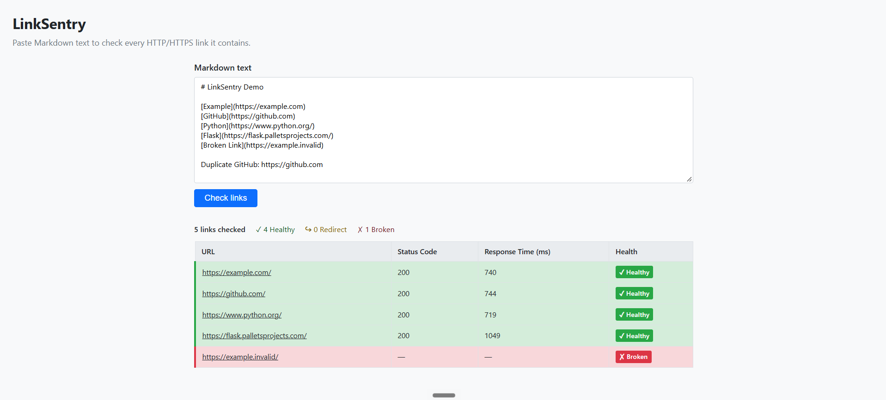
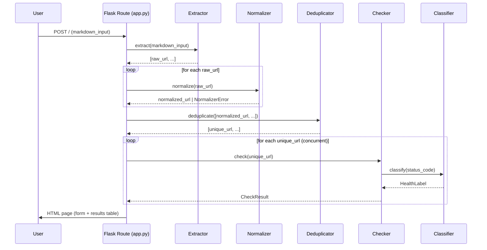

# LinkSentry

LinkSentry is a lightweight, local Flask web application that audits HTTP/HTTPS links in Markdown text. Paste Markdown into the form, and LinkSentry extracts every link, normalises and deduplicates the URLs, checks each one concurrently, and displays a colour-coded results table with status codes, response times, and a Healthy / Redirect / Broken classification.

Built entirely with [Kiro](https://kiro.dev) for the **Kiro University Challenge** using seven distinct Kiro workflows.



---

## Demo

**Demo video:** https://drive.google.com/file/d/1a1DSQ1sHv-0sHAZkVCp2DO_z-yB3aPNO/view?usp=drive_link

---

## Features

- Extracts links from all Markdown syntaxes — inline `[text](url)`, reference `[text][id]`, autolinks `<url>`, and bare URLs with trailing-punctuation stripping
- Normalises URLs to canonical form (lowercase scheme/host, default-port removal, trailing-slash stripping, percent-encoding normalisation)
- Deduplicates normalised URLs so each target is checked exactly once
- Checks each URL concurrently with `ThreadPoolExecutor` (HEAD with automatic GET fallback)
- Follows redirects up to 10 hops; records the final status code
- Classifies results as **Healthy** (2xx), **Redirect** (3xx), or **Broken** (4xx / 5xx / timeout / DNS failure)
- Displays null status code and response time as `—`
- Health indicators use both colour *and* a text badge for colour-blind accessibility
- Returns HTTP 400 for inputs over 500 000 characters; logs and returns HTTP 500 for unexpected pipeline errors
- Configurable listen port via `PORT` environment variable (default 5000)

---

## Architecture

LinkSentry's central principle is **pure-logic / I/O separation**.

```
POST /
  │
  ├─ extract()        ← pure, no network
  ├─ normalize()      ← pure, no network
  ├─ deduplicate()    ← pure, no network
  ├─ check()          ← ONLY component that touches the network
  └─ classify()       ← pure, called inside check()
```

Four components — **Extractor**, **Normalizer**, **Deduplicator**, and **Classifier** — are pure functions with no network access. The **Checker** is the sole owner of all network I/O. This split lets the four pure components be tested exhaustively without any network access, and keeps the Checker's contract narrow and mockable.

### Data flow



---

## Project structure

```
linksentry/
├── app.py                   # Flask route handler and pipeline orchestrator
├── requirements.txt         # Pinned Python dependencies
├── docs/
│   └── linksentry-demo.png  # Demo screenshot (copy here manually)
├── linksentry/
│   ├── __init__.py
│   ├── models.py            # HealthLabel enum, CheckResult, ResultsSummary
│   ├── extractor.py         # Extractor  — pure, no I/O
│   ├── normalizer.py        # Normalizer — pure, no I/O
│   ├── deduplicator.py      # Deduplicator — pure, no I/O
│   ├── classifier.py        # Classifier — pure, no I/O
│   └── checker.py           # Checker — sole network I/O component
├── templates/
│   └── index.html           # Single Jinja2 template (form + results table)
├── static/
│   └── style.css            # Health row classes and text badges
└── tests/
    ├── conftest.py          # Session-scoped socket-blocking fixture
    ├── test_extractor.py
    ├── test_normalizer.py
    ├── test_deduplicator.py
    └── test_classifier.py
```

---

## Tech stack

| Layer | Choice |
|---|---|
| Web framework | [Flask 3.1](https://flask.palletsprojects.com/) |
| HTTP client | [Requests 2.34](https://requests.readthedocs.io/) |
| Concurrency | `concurrent.futures.ThreadPoolExecutor` |
| URL parsing | `urllib.parse` (`urlsplit` / `urlunsplit`) |
| Property-based testing | [Hypothesis 6](https://hypothesis.readthedocs.io/) |
| Test runner | [pytest 9](https://pytest.org/) |
| HTTP mocking | [responses 0.26](https://github.com/getsentry/responses) |
| Python | 3.11+ |

---

## Five correctness properties

These universally-quantified properties are verified by Hypothesis with 200 examples each. They serve as the formal bridge between the requirements spec and machine-verifiable guarantees.

| # | Name | Statement |
|---|---|---|
| 1 | **Extraction Purity** | Every URL returned by `extract()` has scheme `http` or `https` — no `mailto:`, `ftp:`, etc. |
| 2 | **Normalization Idempotence** | `normalize(normalize(u)) == normalize(u)` for all valid URLs `u` |
| 3 | **Deduplication Idempotence** | `deduplicate(deduplicate(L)) == deduplicate(L)` for all lists `L` |
| 4 | **No Duplicate Output** | `len(deduplicate(L)) == len(set(deduplicate(L)))` — output never contains two equal strings |
| 5 | **Deterministic Classification** | `classify(s) == classify(s)` always — the classifier is a pure, side-effect-free function |

### Normalization idempotence bug found and fixed by Hypothesis

During development, Hypothesis discovered a failure of Property 2 when the initial implementation used `urllib.parse.urlparse` / `urlunparse`. On certain inputs containing semicolons in the path, `urlparse` silently splits the path at `;` into a `path` and a `params` component. Reassembling with `urlunparse` would then reinsert `;`, causing a second call to `normalize()` to produce a different string than the first call — breaking idempotence.

The fix was to switch to `urlsplit` / `urlunsplit`, which treats the URL as a five-component tuple `(scheme, netloc, path, query, fragment)` with no `params` component, eliminating the semicolon-splitting behaviour and restoring idempotence.

---

## Seven Kiro workflows used

### 1. Spec-Driven Development
The full project was built spec-first using Kiro's built-in spec workflow: `requirements.md` was written and refined before any code, then `design.md` (high-level + low-level), then `tasks.md`. Implementation followed the task list in dependency-wave order.

Files: `.kiro/specs/link-sentry/requirements.md`, `design.md`, `tasks.md`

### 2. Steering
A workspace-level steering file encodes LinkSentry's engineering constraints — scope limits, Python style, architecture rules, networking safety rules, and testing requirements. Kiro injects these constraints into every agent interaction automatically, so the rules are always in context without repeating them in every prompt.

File: `.kiro/steering/python-style.md`

### 3. Agent Hooks
A `PostFileSave` hook triggers `py -3 -m pytest tests/ -q` automatically whenever Kiro writes a `.py` file. This means every code change is verified immediately without a manual test run.

File: `.kiro/hooks/test-on-save.json`

### 4. Property-Based Testing
Hypothesis verifies all five correctness properties across 200 random examples each. A session-scoped `conftest.py` fixture patches `socket.socket` to raise `RuntimeError` for any real network call, enforcing the pure/IO separation at test time.

Files: `tests/conftest.py`, `tests/test_extractor.py`, `tests/test_normalizer.py`, `tests/test_deduplicator.py`, `tests/test_classifier.py`

### 5. Powers
A custom Kiro Power — **LinkSentry Link Auditor** — packages project-specific audit guidance as an installable skill. Activating the `audit` skill loads a checklist of the eleven network-safety and correctness rules directly into the agent's context, enabling structured code review without restating the rules in the prompt.

Files: `.kiro/powers/link-auditor/plugin.json`, `.kiro/powers/link-auditor/skills/`

### 6. MCP (Model Context Protocol)
The project configures the `mcp-server-fetch` MCP server, which gives Kiro live internet access via the `fetch::fetch` tool. This was used during development to fetch `https://example.com` and compare the live HTTP response against what LinkSentry's checker is expected to report — a concrete correctness check using real data.

File: `.kiro/settings/mcp.json`

### 7. Custom Agent
A project-scoped custom agent — `linksentry-dev` — bundles the spec files, steering rules, MCP tools, and the LinkSentry Power into a single reusable context. It is pre-prompted as a dedicated correctness reviewer with permission to run the test suite, so any collaborator can open it and start reviewing or extending LinkSentry with the full context already loaded.

File: `.kiro/agents/linksentry-dev.json`

---

## Local setup

**Prerequisites:** Python 3.11+, pip

```bash
# Clone and enter the project
cd linksentry

# Install pinned dependencies
py -3 -m pip install -r requirements.txt

# Run the app (default port 5000)
py -3 app.py
# or
flask run

# Custom port
PORT=8080 py -3 app.py
```

Open [http://localhost:5000](http://localhost:5000) in your browser, paste some Markdown, and click **Check links**.

---

## Running tests

```bash
py -3 -m pytest tests/ -q
```

**Current result: 36 passed**

The suite covers:

- Unit tests for all four pure-logic components (extractor, normalizer, deduplicator, classifier)
- Hypothesis property-based tests for all five correctness properties (200 examples each)
- A session-scoped socket-blocking fixture that fails any test which accidentally opens a real network connection

---

## Requirements snapshot

| Req | Description |
|---|---|
| 1 | Markdown input form with inline validation, loading indicator, 500 000-char limit |
| 2 | Extract HTTP/HTTPS links from inline, reference, autolink, and bare-URL syntaxes |
| 3 | Normalise URLs to canonical form (10 rules including idempotence) |
| 4 | Deduplicate normalised URLs; preserve first-occurrence order |
| 5 | HEAD with GET fallback; follow ≤10 redirects; 10 s timeout |
| 6 | Classify 2xx → Healthy, 3xx → Redirect, else → Broken |
| 7 | Results table: URL, Status Code, Response Time (ms), Health; summary counts |
| 8 | Pure logic strictly separated from network I/O |
| 9 | Per-URL error isolation; HTTP 500 on pipeline error; HTTP 400 on oversized input |
| 10 | `flask run` / `python app.py`; `PORT` env var; pinned `requirements.txt` |
